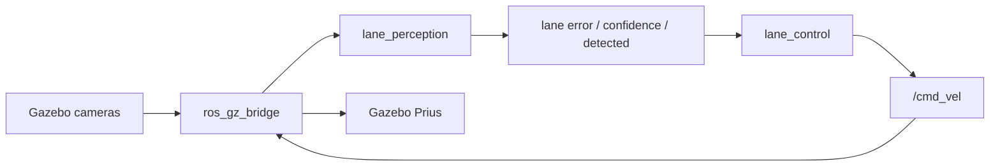

# ROS 2 Lane Following — Gazebo Prius

*Camera-based lane detection and control for the Prius on Sonoma Raceway, bridging Gazebo (Gz Sim) and ROS 2.*

## Highlights

- End-to-end pipeline: camera → lane error → `/cmd_vel`
- Traditional OpenCV perception (ROI, HSV/HLS segmentation, look-ahead estimation) — no deep learning required
- PD steering with curve-aware speed reduction and safety watchdogs (stale perception / lane loss)
- Annotated debug view published as an image topic for live inspection
- Tested on ROS 2 Humble; portable to Jazzy+ with a minimal configuration change

## Demo

- **Video:** _TBD_
- **Rosbag (`cmd_vel_bag`):** _TBD_
- **Best lap time:** _TBD_

## Table of Contents

- [Overview](#overview)
- [Repository Structure](#repository-structure)
- [Compatibility](#compatibility)
- [Bridge Configuration](#bridge-configuration)
- [Packages](#packages)
- [Dependencies](#dependencies)
- [Build](#build)
- [How to Run](#how-to-run)
- [Recording a Bag](#recording-a-bag)
- [Tuning](#tuning)
- [Troubleshooting](#troubleshooting)
- [Authors](#authors)

---

## Overview

This project bridges the Prius car world in Gazebo (Gz Sim) to ROS 2, then drives the car around the track while staying in lane. A camera-based perception node detects the lane ahead and publishes a normalized lateral error; a control node converts that error into velocity commands, closing the perception-to-action loop shown below.



---

## Repository Structure

This repository contains the two ROS 2 packages, the bridge configuration, and documentation. Generated build artifacts (`build/`, `install/`, `log/`) and unrelated packages are intentionally excluded.

```text
.
├── README.md
├── .gitignore
├── config/
│   ├── gz_sim_bridge_car.yaml            # Jazzy+ — gz.msgs.*
│   └── gz_sim_bridge_car_humble.yaml     # Humble/Fortress — ignition.msgs.*
├── lane_perception/                      # Perception package
│   ├── lane_perception/
│   │   └── lane_detector.py              # Lane detection node
│   ├── config/
│   │   └── lane_perception.yaml          # Detection parameters
│   ├── resource/
│   │   └── lane_perception
│   ├── setup.py
│   ├── setup.cfg
│   └── package.xml
└── lane_control/                         # Control package
    ├── lane_control/
    │   └── lane_controller.py            # Lane-following control node
    ├── config/
    │   └── lane_control.yaml             # PID and speed parameters
    ├── launch/
    │   └── lane_following.launch.py      # Combined launch file
    ├── resource/
    │   └── lane_control
    ├── setup.py
    ├── setup.cfg
    └── package.xml
```

---

## Compatibility

Requires **ROS 2 Jazzy (or newer)**. Developed and tested on:

- **WSL 2** / Ubuntu 22.04
- **ROS 2 Humble**
- **Gazebo Fortress** (`ign gazebo` 6.18)
- **ros_gz_bridge** 0.244.x

The Python nodes are portable to Jazzy with little or no code change. The only version-specific difference is the Gazebo message type names in the bridge YAML (`ignition.msgs.*` on Humble/Fortress instead of `gz.msgs.*` on Jazzy+); see [Bridge Configuration](#bridge-configuration).

---

## Bridge Configuration

The bridge is configured with `config/gz_sim_bridge_car.yaml` (Jazzy naming) or `config/gz_sim_bridge_car_humble.yaml` (Humble naming), passed to the bridge with a `config_file:=…` argument.

### Humble compatibility

| File | Use when |
|------|----------|
| `config/gz_sim_bridge_car.yaml` | Jazzy+ (`gz.msgs.*`) |
| `config/gz_sim_bridge_car_humble.yaml` | Humble/Fortress (`ignition.msgs.*`) |

**Compatibility change only:** `gz.msgs.*` → `ignition.msgs.*`  
**Unchanged:** all ROS topic names.

```bash
mkdir -p ~/ros2_ws/config_tmp
cp config/*.yaml ~/ros2_ws/config_tmp/
```

---

## Packages

### `lane_perception` — lane detection (`lane_detector`)

Subscribes to the camera feed (default `/prius/front_camera/image_raw`; any of the four bridged cameras may be selected via the `camera_topic` parameter) and runs a traditional OpenCV pipeline: region-of-interest cropping, HSV/HLS color segmentation (yellow lane paint and white barriers), look-ahead edge estimation, and a left/right lane-center estimate.

| Topic | Type | Direction | Description |
|---|---|---|---|
| `/prius/front_camera/image_raw` | `sensor_msgs/Image` | Subscribe | Camera input (configurable) |
| `/lane/error` | `std_msgs/Float32` | Publish | Normalized lateral error, ≈ [−1, 1] |
| `/lane/confidence` | `std_msgs/Float32` | Publish | Detection confidence in [0, 1] |
| `/lane/detected` | `std_msgs/Bool` | Publish | Lane presence flag |
| `/lane/debug_image` | `sensor_msgs/Image` | Publish | Annotated debug view (if `debug_enabled`) |

**Error convention**

- **Negative** error → lane center is left of the image center → the car is drifting **right**.
- **Positive** error → lane center is right of the image center → the car is drifting **left**.

### `lane_control` — control node (`lane_controller`)

Subscribes to `/lane/error`, `/lane/confidence`, and `/lane/detected`, and publishes `/cmd_vel` (`geometry_msgs/Twist`).

- PD steering: `angular.z ≈ −Kp·error − Kd·Δerror/Δt` (an integral term is available via `ki`, disabled by default).
- Speed reduction in curves: linear velocity scales down with steering effort.
- Safety watchdogs: stops the car if perception is stale (`perception_timeout`) or the lane is lost for too long (`lost_lane_timeout`); brief dropouts hold the last steering angle at low speed (`lost_hold_steer_time`).
- Publishes a zero `Twist` on shutdown.

The combined launch file `lane_control/launch/lane_following.launch.py` starts both nodes with their parameter files; `use_sim_time` defaults to `true`.

---

## Dependencies

```bash
source /opt/ros/humble/setup.bash
sudo apt update
sudo apt install -y \
  ros-humble-ros-gz-bridge \
  ros-humble-cv-bridge \
  ros-humble-rqt-image-view \
  python3-opencv
```

---

## Build

Place (or symlink) the two packages into a ROS 2 workspace `src/`, then:

```bash
source /opt/ros/humble/setup.bash
cd ~/ros2_ws
colcon build --symlink-install --packages-select lane_perception lane_control
source ~/ros2_ws/install/setup.bash
```

Verify:

```bash
ros2 pkg executables lane_perception
ros2 pkg executables lane_control
```

---

## How to Run (separate terminals)

> The commands below assume the WSL user `ibrahim` and a workspace at `~/ros2_ws`. Adjust `HOME` and the workspace path if your machine differs.

### Terminal 1 — Gazebo

On Humble / WSL, software GL is often required:

```bash
export HOME=/home/ibrahim
export DISPLAY=:0
export LIBGL_ALWAYS_SOFTWARE=1
export MESA_GL_VERSION_OVERRIDE=3.3
source /opt/ros/humble/setup.bash
ign gazebo -r "$HOME/.ignition/fuel/fuel.gazebosim.org/openrobotics/worlds/prius on sonoma raceway/1/sonoma.sdf"
```

(Alternatively, open **Prius on Sonoma Raceway** from the Gazebo GUI if the world is available through the Fuel browser.)

### Terminal 2 — Bridge

**Humble:**

```bash
export HOME=/home/ibrahim
source /opt/ros/humble/setup.bash
ros2 run ros_gz_bridge parameter_bridge --ros-args \
  -p config_file:=$HOME/ros2_ws/config_tmp/gz_sim_bridge_car_humble.yaml
```

**Jazzy:** use `gz_sim_bridge_car.yaml` and `gz.msgs.*`.

Confirm the bridged topics:

```bash
ros2 topic list -t
```

You should see `/clock`, `/cmd_vel`, `/odom`, `/tf`, the `/prius/...` camera topics, and `/prius/camera_info`.

Manual motion test:

```bash
ros2 topic pub --once /cmd_vel geometry_msgs/msg/Twist "{linear: {x: 0.5}, angular: {z: 0.0}}"
ros2 topic pub --once /cmd_vel geometry_msgs/msg/Twist "{linear: {x: 0.0}, angular: {z: 0.0}}"
```

### Terminal 3 — Perception + control

```bash
export HOME=/home/ibrahim
source /opt/ros/humble/setup.bash
source ~/ros2_ws/install/setup.bash
ros2 launch lane_control lane_following.launch.py use_sim_time:=true
```

### Optional — debug image

```bash
ros2 run rqt_image_view rqt_image_view
# select /lane/debug_image
```

---

## Recording a Bag

Record a rosbag of the velocity commands to review or share a run:

```bash
ros2 bag record -o cmd_vel_bag /cmd_vel
```

Start **immediately before** the run; stop **immediately after**.

Inspect:

```bash
ros2 bag info cmd_vel_bag
```

Do not commit large bags to the repository unless required.

---

## Tuning

1. Achieve reliable lane keeping first before increasing speed.
2. Raise `base_speed` in `lane_control/config/lane_control.yaml` only after step 1.
3. Tune `kp` first, then `kd`, then `ki` (the integral term is disabled by default).
4. If the car steers the wrong way, invert the steering sign in the controller (`angular.z = −Kp·error`).

---

## Troubleshooting

| Symptom | Likely cause |
|---------|--------------|
| `Waiting for matching subscription(s)` on `/cmd_vel` | Bridge not running |
| No camera topics | World not running / wrong bridge YAML / wrong GZ type names |
| Gazebo GUI blank/crash on WSL | Use `LIBGL_ALWAYS_SOFTWARE=1` |
| Car stops | Lane lost timeout or stale perception watchdog |
| Jazzy bridge fails on Humble | Use `gz_sim_bridge_car_humble.yaml` |

---

## Authors

| Name | ID |
|------|----|
| Mohamed Amgad | 2203181 |
| Ibrahim Mohamed Mahros | 2203186 |
